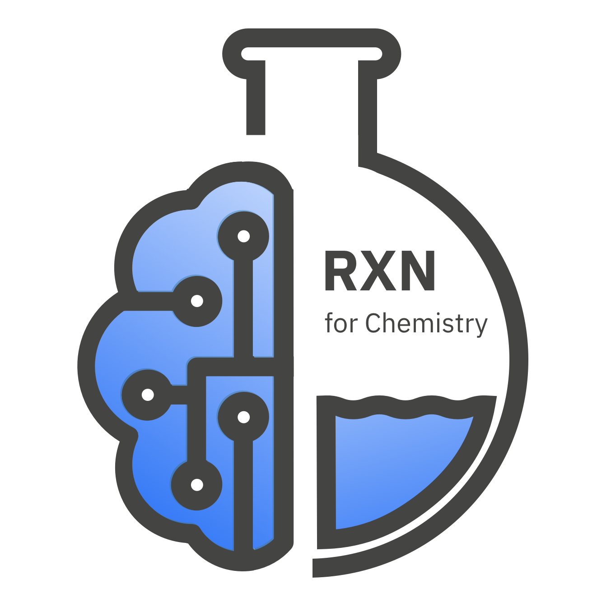

# Open-source RXN models

  

## Molecular Transformer reaction prediction

- Original Molecular Transformer ([GitHub - pschwllr/MolecularTransformer](https://github.com/pschwllr/MolecularTransformer), [Models](https://ibm.ent.box.com/v/MolecularTransformerModels))

## RXNMapper (atom-mapping)

- [RXNMapper ALBERT model](https://github.com/rxn4chemistry/rxnmapper/tree/master/rxnmapper/models/transformers/albert_heads_8_uspto_all_1310k)

## Fingerprints

- [Fingerprint models](https://github.com/rxn4chemistry/rxnfp/tree/master/rxnfp/models/transformers)

## Classification

- [USPTO 1k TPL model](https://github.com/rxn4chemistry/rxnfp/tree/master/rxnfp/models/transformers/bert_class_1k_tpl)

## RXN yield prediction models

- [Trained models](https://github.com/rxn4chemistry/rxn_yields/tree/master/trained_models)
